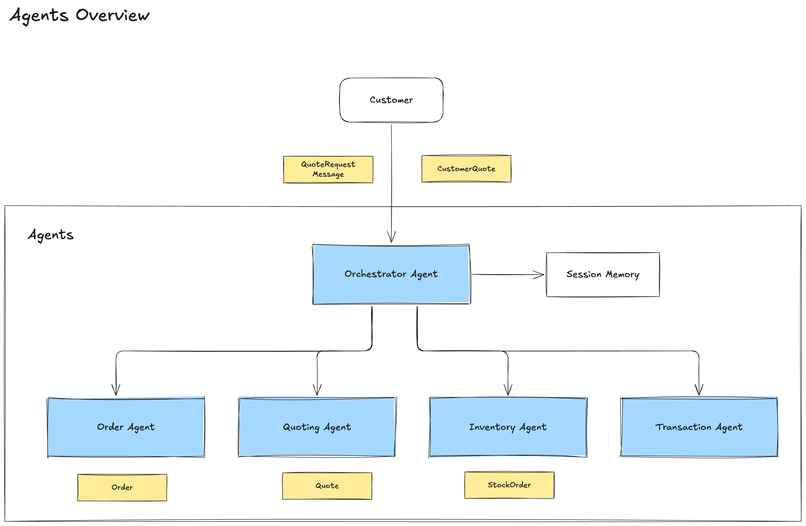
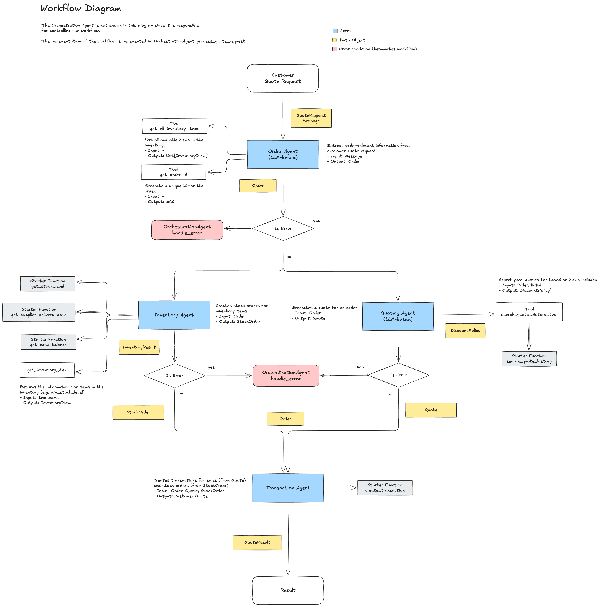

# Reflections on Project Assignment

This document contains the documentation for the "Beaver's Choice Paper Company" / "Munder Difflin" Multi-Agent System project for course 4 of the Udacity Nanodegree **AI Agents**.

## 1. Project Objective

The objective is to implement a smart, adaptable system for the company to automate it's sales process with the help of AI. The process consists of the main following steps:

-   Inventory checks and restocking decisions
-   Quote generation for incoming sales inquiries
-   Order fulfillment including supplier logistics and transactions

Some assumptions had to be made by the author to come up with a solution and these assumptions have been documented in the section: [Assumptions & Notes](#assumptions--notes)

## 2. Architecture

### Selected Agent Framework

Pydantic-AI has been selected as the framework for building the systems. The key criteria was the build in support for Structured Outputs (via Pydantic), which was considered a big support when building reliable agents.

### Agent Documentation

The architecture follows the Orchestrator pattern, which uses a central Orchestration Agent to implement the main workflow and to route the data between the individual, specialized agents.

The actual workflow is implemented in the `process_quote_request` method of the OrchestrationAgent. The agent dispatches the request in a pre-determined workflow to the individual agents which implement specific steps in the workflow.

**Note**: The diagram shows that the Agents InventoryAgent and QuotingAgent are run in parallel. This is a reasonable choice since both are independent. Neverthless, to keep the implementation simple, the two steps are implemented sequentially: the InventoryAgent is called before the QuotingAgent.

The diagrams are located in the folder [Diagrams](./diagrams/).

#### Orchestration Agent

The Orchestration Agent controls the dataflow between the individual agents. While the business logic implemented in this agent is minimal (mainly the dataflow logic), the agent is a critical component that provides

-   _Memory Management_: the short-term memory management that is required during the process. The initial version of this agent does not implement memory management yet since the process of generating a quote is completed after method-call returns and the method is stateless. For the following extension (Customer Agent for negotiations), a memory component is needed since this is typical multi-turn interaction between agents.
-   _Error Handling_: in case errors are encountered in the process, the Orchestration Agent executes compensating actions that it tracks across the duration of the process.
-   _Process Logging_: logs each step for analysis and auditing

##### Interfaces

-   Input Schema: Message (str) including the customer request and the expected data of delivery.
-   Output Schema: CustomerQuote (string representation of the quote following the CSV schema)
-   Tools: none

#### Order Agent

The Order Agent represents the initial agent that is called to process the customer request. It processes the request and extracts the relevant data for the following process steps. The agent is also responsible for handling customer messages that aren't valid quote requests. In this case, an error is returned to the Orchestration Agent.

##### Interfaces

-   Input Schema: Customer message (str)
-   Output Schema: Order or Error
-   Tools:
    -   get_all_inventory: list all available products in the inventory

#### Quoting Agent

The Quoting Agent specialized on generating quotes for customer orders. This includes the steps:

1. Calculate amount: based on order details
2. Determine discount policy for order:
    - Search for similar quotes
    - Identifying a reasonable discount policy
3. Apply the discount policy to each individual item in the order
4. Generate a quote message for the customer

Searching for historic quotes uses the products from the current order. This is a very basic search strategy but the analysis of the quote data has shown that is matches relatively well.

##### Interfaces

-   Input Schema: Order
-   Output Schema: Quote
-   Tools:
    -   seach_quote_history_tool: search for existing quotes with the same products.

#### Inventory Agent

The Inventory Agent encapsulates the fulfillment of orders and the necessary inventory management. The result is a Stock Order, which contains individual stock order items that need to be purchased to complete the order.

This agent can be run in two different modes:

-   `InventoryAgent.process_order_direct`: This implements the core logic for managing the inventory (i.e. creating stock orders) in Python code. The logic is quite straightforward but helped to formulate the rules for how the inventory is managed and how to handle exceptional conditions.
-   `InventoryAgent.process_order_llm`: This method uses an LLM with function calling to process the order according to the rules. Two separate versions of the system prompt have been created. The first one defines the process steps in the prompt. The second one uses the ReAct pattern and requests the LLM to come up with a plan that achieves the stated goal.

The LLM version proofed to be surprisingly effective, with a powerful model like `gpt-4o`. Given that the direct-implementation was done prior, the prompt benefited from the deeper understanding of the necessary logic. For a smaller model like `gpt-4o-mini` several problems have been spotted but these have not been investigated in more detail for now.

##### Interfaces

-   Input Schema: Order
-   Output Schema: Stock Order
-   Tools: none

#### Transaction Agent

The Transaction Agents handles both Sales and Stock Order transactions. It generates the respective transactions (`sales` and `stock_order`) using the provided function from the starter code.

This agent does not use an LLM since all the data is provided by typed data objects. And the mapping from the order and stock items parameters is deterministic. Extended version of the inventory management might use an LLM to apply dynamic optimizations to the transactions to improve business efficiency.

##### Interfaces

-   Input Schema: Transaction
-   Output Schema: TransactionResult
-   Tools: none

## 3 Testing

The workflow has been tested several times with different configurations:

1. Model Type: gpt-4o, gpt-4o-mini
2. Direct or LLM-based implementation of Inventory Management

Two result files have been created to capture the complete processing output for the sample quote requests as specified in the project rubric\_

-   [`test_results_direct.csv`](./test_results_direct.csv): using the direct implementation (Python) for the Inventory Agent.
-   [`test_results_direct.csv`](./test_results_llm.csv): Using the LLM-based implementation of the Inventory Agent.

Both tests have been run with `gpt-4o` as the model for all individual agents. A test has been done with `gpt-4o-mini`, but this showed several problems in terms of the result quality and reliability.

While `gpt-4o` is able to extract the order details from the customer quote request very reliably, ``gpt-4o-mini` fails for a substantial percentage of cases (> 25%), while not really bringing big improvements to latency.

## 3. Improvements & Opportunities

### Parallelization

The current implementation of the process is sequential. Nevertheless, the agents "Quoting" and "Inventory" can run in parallel since both are independent.

### Including Human-Experts

For an agentic system like the Paper Quoting system, implementing a human-in-the-loop approach will benefit the reliability of the process greatly. While the system is capable to process unstructured requests with a reasonable success rate, the open-ended nature of the problem will eventually lead to customer requests that cannot be processed without additional human input. In addition, certain quotes (e.g. by order volume, discount rates, product items, etc.) might require human approval before being returned to customers, potentially involving re-generating the quote with additional feedback.

A system architecture for including human feedback and approvals might require a more complex memory management to store data and feedback, and the ability to resume or restart the project after human review.

### Updating the Inventory table

The inventory is technically managed using an event-sourcing approach, using both past Sales and StockOrder transactions to track the stock level. This help when implementing compensating actions for errors identifying the associated transactions (events).

While this is a very elegant way, it will eventually lead to performance problems. The inventory table can therefore be updated periodically. This requires that a proper timestamp is persisted to combine both data from the inventory with the

This is not directly related to the agentic architecture but rather to the general architecture of event driven systems.

## 4. Assumptions & Notes

### Paper Industry-Specific Quantity Definitions

Some of the quote-requests contain amount specified as "reams" or "boxes". The inventory and pricing on the other hand are specified as "units", which was read as "per paper". Therefore, following mapping assumptions have been made after some research:

-   ream: 500 units (papers)
-   box: 5000 units (papers)

### Handling Unknown Paper Products

The sample request contain several requests for products that are not specified in the inventory. The agent tries to map them to similar products.

A more mature system would likely provide a more restricted mapping to ensure that customers only receive the products they intended to order. Orders with any items that cannot be matched should then be sent to a human-expert for review and adjustments.

## Final Thoughts

This project assignment was really insightful and triggered a lot of questions about how to build reliable and scalable solutions for real-world use cases. It also helped me to refine my view of how to design and implement agentic systems. With more then 20 year of experience in software design, I might have to "unlearn" some of my best practices for solving problems with agents.

One key consideration is to decide when to use an LLM-based agent versus coding the behavior directly (in Python). In some cases (Order processing, Quoting), the benefits of an LLM are clear given the ability of the LLM to process unstructured data and reason. In other cases (e.g. Inventory and transaction processing), using traditional development is a good choice if the interface is clear and the data is well structured. While the results of the LLM-based Inventory Agent are impressive, it benefited greatly from my experience that I gained during implementing the logic myself. Still, I will investigate deeper into the LLM-based approach since this has shown very successful.

The current implementation of the system is definitely not ready for production since it misses critical functionality and would not meet the standards of business experts in the paper industry:

-   Product Matching: The matching is very simplistic and we can expect the process to fail to match products properly. This can result in failures to extract the data properly (e.g. product names or quantities) or result in wrong orders with mis-matched items.
-   Human-in-the-Loop: Experts would be required to resolve issues when products cannot be matched. This would require an (asynchronous) system where order data can be manually updated before further processing. The same is true to a final approval for quotes before they are send out to the customer.
-   Error Handling: As noted above, a production-ready solution would need to have robust error handling (transactions or compensating actions) and a clear escalation process to human-experts (e.g. sales backoffice team)

In general, while agents are definitely a very powerful tool, especially if they are using LLMs to implement complex steps in the process, getting them production-ready is challenging and require proper planning.
